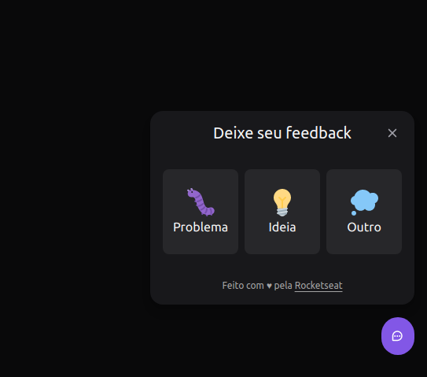
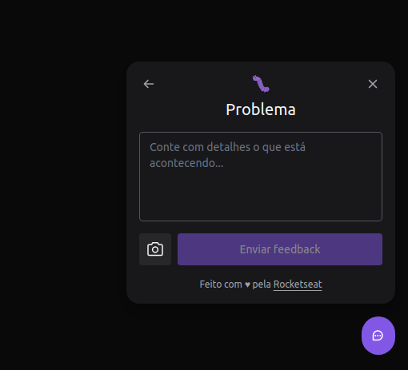
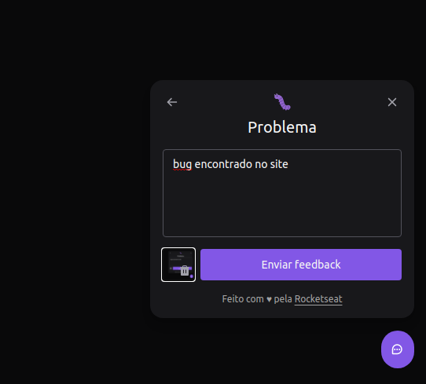
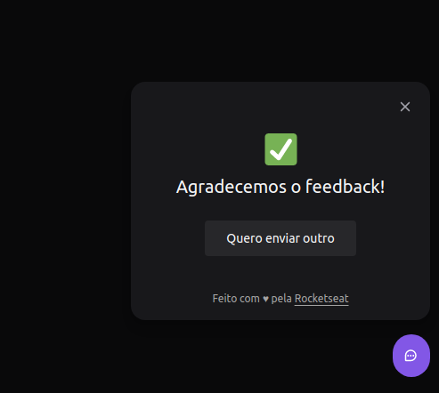

## 💻 Projeto
Site para o usuário fazer um feedback do site, sendo de um bug, ideia ou outro. Tendo a opção de tirar um print da tela ao clicar para enviar a evidência.

<h1 align="center">
    <a href="https://feedback-widget-web-two.vercel.app/">🔗 FeedbackWidget</a>
</h1>

<strong>Botão Widget:</strong>
<br/>


<strong>Widget Aberto:</strong>
<br/>


<strong>Tipo de Feedback selecionado:</strong>
<br/>


<strong>Formulário preenchido:</strong>
<br/>


<strong>Feedback enviado:</strong>
<br/>

    
## ✨ Tecnologias

-   [ ] React
-   [ ] Typescript
-   [ ] Popover
-   [ ] TailwindCSS
-   [ ] Vite
-   [ ] Phosphor Icons
-   [ ] Axios


## :hammer_and_wrench: Features 

-   [ ] Criação do componente Widget
-   [ ] Abrir Opções de feedbacks após o clique no componente Widget
-   [ ] Abrir Formulário após o clique na opção que ele deseja
-   [ ] Tirar print da tela após clicar no ìcone de câmera e armazenar para utilizar posteriormente
-   [ ] Tirar print da tela após clicar no ìcone de câmera e armazenar para utilizar posteriormente
-   [ ] Após o usuário digitar e tirar o print da tela e clicar em enviar, enviar a requisição de Post pro backend.
-   [ ] Tela de Sucesso após eviar a requisição.


## 🚀 Como executar

Clone o projeto e acesse a pasta do mesmo.

```bash
$ git clone https://github.com/rafaelborges26/feedbackWidget-web
```

Para iniciá-lo, siga os passos abaixo:
```bash
# Instalar as dependências
$ yarn
# Iniciar o projeto
$ yarn dev
```
O app estará disponível no seu browser pelo endereço http://localhost:3000.
